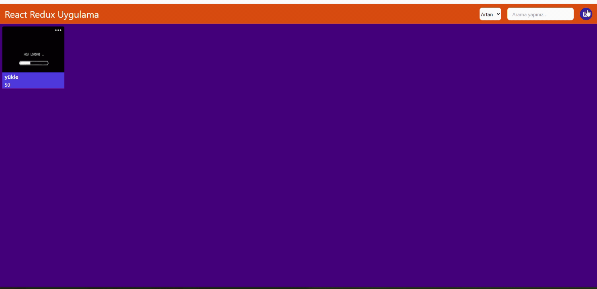
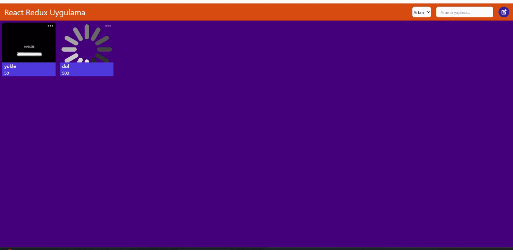

# React Redux Uygulama

# İşlemler

- Modal oluşturup ürün ekle, düzenle, çıkar yapıldı
- Sıralama ve arama işlemi yapıldı
- Artan, azalan işlemi yapıldı

# kütüphaneler

- @reduxjs/toolkit
- react-redux
- react-icons
- react-router-dom
- tailwind

# Ekran görüntüsü

# 

# 
